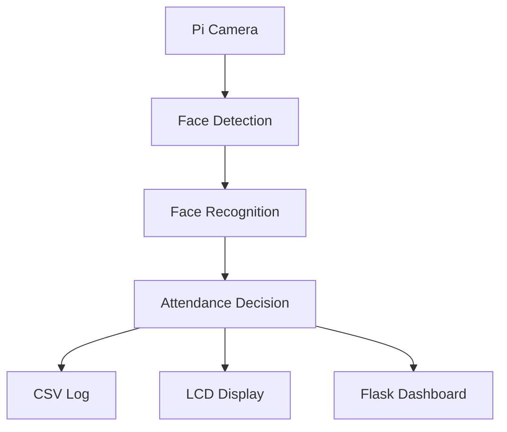

# Smart Face Attendance System using Raspberry Pi


This project presents a Raspberry Pi-based smart attendance system using real-time face recognition technology. Instead of relying on RFID cards or fingerprint sensors, employee identities are verified automatically through facial recognition.

The system integrates computer vision, a web-based employee management interface, motion detection, and automatic attendance logging into a single embedded platform.


# Features

- Real-time face recognition using dlib and OpenCV
- Automatic employee dataset collection
- Automatic face encoding generation
- PIR-based motion detection
- Flask web dashboard
- LCD attendance notification
- CSV attendance logging
- Raspberry Pi embedded deployment

# Project Structure
```text
Face-Attendance-System/
│
├── dataset/
├── web_app/
│   ├── static/
│   │   └── style.css
│   │
│   ├── templates/
│   │   ├── base.html
│   │   ├── attendance.html
│   │   ├── employees.html
│   │   ├── employee_detail.html
│   │   └── add_employee.html
│   ├── app.py
│   └── employees.json
├── attendance_log.csv
├── encodings.pickle
├── face_attendance.py
├── image_capture.py
├── model_training.py
├── requirements.txt
└── README.md
```

# Hardware 

- Raspberry Pi 4 (2GB or higher recommended)
- Raspberry Pi Camera Module (v2 or v3)
- PIR motion sensor HC-SR501 (optional)
- 5V relay module
- 16×2 I2C LCD (optional)

# System Architecture



# Getting Started
1. Clone project

2. Install dependencies

3. Prepare dataset

4. Train model

5. Start Flask

6. Start Attendance


```bash
# 1. Clone repo
git clone https://github.com/phuonght098/FaceDetection.git
cd FaceDetection

# 2. Create virtual environment
python3 -m venv face_rec
source face_rec/bin/activate

# 3. Install dependencies
pip install -r requirements.txt

# 4. First-time training (if you already have photos in dataset/)
python3 model_training.py

# 5. Run everything
# Terminal 1 – Web Dashboard
python3 web_app/app.py

# Terminal 2 – Attendance 
python3 face_attendance.py
```

# Results

- Recognition accuracy: ~95–98%
- Recognition distance: 0.5–2 m
- Recognition time: < 5 s
- Attendance logging latency: < 3 s
- Tested employees: 10+

## System Response Time

The overall response time of the proposed attendance system was evaluated from the moment a person enters the camera's field of view until the attendance record is successfully completed.

| Stage | Typical Time | Description |
| :--- | :---: | :--- |
| Motion Detection (PIR) | 0.3 – 0.5 s | PIR sensor detects human movement with debounce filtering to reduce false triggers. |
| Face Recognition | 3 – 5 s | Face detection, feature encoding, and identity matching using the `face_recognition` library. |
| Attendance Processing | 2 – 3 s | Display employee information on the LCD and save attendance records to the CSV log. |
| **Total Response Time** | **5.5 – 8.5 s** | Complete process from motion detection to attendance logging. |

## Discussion

The face recognition stage accounts for the majority of the execution time because the Raspberry Pi performs both face detection and encoding comparison on the CPU. Under normal indoor lighting conditions, the entire attendance process is completed within 5.5–8.5 seconds, which is sufficient for office and laboratory attendance applications.

System performance can be further improved by:

Reducing the camera resolution (e.g., 320×240).
Maintaining stable lighting conditions.
Limiting the number of registered face encodings.
Running background logging tasks asynchronously.

# Future Work
• Replace the standard camera with an infrared camera for low-light recognition.

• Synchronize attendance records with Firebase or Google Sheets.

• Develop a mobile application for remote attendance notifications.

• Add voice feedback through a speaker module.

• Improve recognition accuracy using deep learning models.

# Contract

Author: Huynh Thanh Phuong

Email: phuong0342098446@gmail.com

LinkedIn:

⭐ If you find this project useful, please consider giving it a Star.
